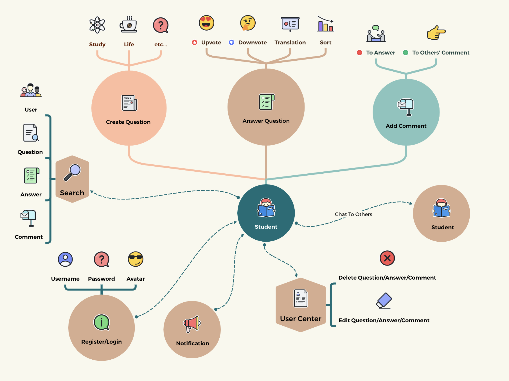

  

## Introduction

This is an online and real-time Q&A platform based on UZH IFI's study and life, we hope the students can exchange the thoughts on this platform and get the answers immediately they wish for.

The platform also has some social features, with tagging for specific questions and live chat between users, and we hope that everyone will share their daily routines to increase their social circle within UZH.

This is a diagram of the functionality of our Web Application:

## Technologies

- [Springboot](https://spring.io/) - Java framework to create a micro service
- [Gradle](https://gradle.org/) - Automated building and management tool
- [MySQL](https://www.mysql.com/) - Database
- [React](https://reactjs.org/docs/getting-started.html) - Javascript library for the whole frontend
- [Ant Design](https://ant.design/) - React design Component library
- [Github Projects](https://github.com/explore) - Project Management
- [Figma](https://figma.com/) - Mockups
- [Google Cloud](https://cloud.google.com/) - Deployment
- [SonarCloud](https://sonarcloud.io/) - Testing & Feedback of code quality

## High-level components

### Question List Page

The Question List page is our main page, where you can see the questions asked by any user and click on them to go to the Answer Page.

[Question List Page](https://github.com/sopra-fs23-group-38/sopra-fs23-38-client/blob/main/src/components/views/Index.js)

### Answer Question Page

Users can access the Answer page by clicking on a Question in the Question List and perform a series of actions on the Answer page (described in detail in the illustration)

[Answer Question Page](https://github.com/sopra-fs23-group-38/sopra-fs23-38-client/blob/main/src/components/views/Question/%5Bid%5D.js)

### Comment Page

By clicking on the Comment button under each Answer, the user can access the Comment page and display the nested form of the Comment.

[Comment Page](https://github.com/sopra-fs23-group-38/sopra-fs23-38-client/blob/main/src/components/views/Question/answer/%5Bid%5D.js)

## Deployment and Database

### Deployment on Google Cloud

Our application is hosted on [Google Cloud URL](https://sopra-fs23-group-38-client.oa.r.appspot.com/). Also our server status is available in this link [Google Cloud URL](https://sopra-fs23-group-38-server.oa.r.appspot.com/). All cloud deployments are now complete and can be accessed directly via the link above.

### MySQL Database

This application use MySQL database to store data.

## Launch and Development

### Prerequisites and Installation

For your local development environment, you will need Node.js. You can download it [here](https://nodejs.org). All other dependencies, including React, get installed with:

`npm install`

Run this command before you start your application for the first time. Next, you can start the app with:

`npm run dev`

Now you can open [http://localhost:3000](http://localhost:3000) to view it in the browser.

Notice that the page will reload if you make any edits. You will also see any lint errors in the console (use Google Chrome).

### Testing

Testing is optional, and you can run the tests with `npm run test`.
This launches the test runner in an interactive watch mode. See the section about [running tests](https://facebook.github.io/create-react-app/docs/running-tests) for more information.

> For macOS user running into a 'fsevents' error: https://github.com/jest-community/vscode-jest/issues/423

### Build

Finally, `npm run build` builds the app for production to the `build` folder. 
It correctly bundles React in production mode and optimizes the build for the best performance: the build is minified, and the filenames include hashes. 

See the section about [deployment](https://facebook.github.io/create-react-app/docs/deployment) for more information.

## Illustrations

### Home Page

The Home page should be the first page the user sees before logging in. It should contain a list of all the questions that users created. Also, when someone creates a new issue, the user can see the update of the issue in real time on this page. Users can also sort questions by tag option to select topics of interest to them. By default, questions are sorted according to the order in which they are created, but users can also sort questions according to the number of responses to follow those that are more popular.    

### Register Page

The register page should be the first page the user sees after clicking on the register button. It should contain a form where the user can enter his username, password(double check), email(Format validation), birthday(optional) and set their own avatar.    

### Login Page

The login page should be the first page the user sees after clicking on the login button. It contains a form where the user can enter his username and password to login correctly.    

### Search Page

Users can use the search page to search for everything they want by keyword, or they can use the different options to search for User, Question, Answer or Comment. The search results can be clicked on and redirected.    

### Create Question Page

When the user creates a question, the user can enter the title of the question, the description and the tag used to classify the question.    

### Answer Question Page

This screen allows users to answer questions, upvote/downvote answers, and optionally sort Answers by the number of votes, as well as accessing each Answer's Comment page through this page.    

### Comment Page

In the Comment Page, users can add comments to different Answers or Comments, and the Comments are displayed in a very clear nested format so that people can clearly see which user is commenting on which question.

### User Center Page

In the User Center Page, users can edit the questions they have asked, the answers they have created and the comments they have made, as well as view the Notifications they have received and jump to the corresponding page via Notification. You can also view other people's User centres and chat with them.    

### Chat Page

The chat page should be the first page the user sees after clicking on the chat button. It should contain a box about messages with other users.    

## Roadmap

### Access to the Switch.edu interface

Firstly, we wanted to make the app accessible and beneficial to more UZH students and staff, so firstly we wanted the login interface to be accessible to Switch.edu, allowing UZH students to discuss and share and socialise directly on the app in their real names.

### More user actions

At the moment our users can do a lot within the app, but we think there is still room for improvement. For example, users can bookmark or share questions that interest them, or they can personalise their user centre to better present themselves.

### More social features

We want this application to be more than just a Q&A platform, but we want to use it as a social platform for UZH students internally. So I hope we can develop more social features, such as adding friends and following each other rather than just chatting.

## Authors and acknowledgment

### Contributors

- **Hangchen Xie** - [Github](https://github.com/hangchenxie)
- **Yunlong Li** - [Github](https://github.com/1316827294)
- **Yuanzhe Gao** - [Github](https://github.com/ArthasGAO)
- **Qiyue Shang** - [Github](https://github.com/QiyueShang666)

### Supervision

- **Hyeongkyun (Kaden) Kim** - [Github](https://github.com/hk-kaden-kim)

## License(最后改)

[Apache license 2.0](https://github.com/sopra-fs23-group-38/server/blob/6dc8281b0a876fa1d310626a704e0e4bfa08b86d/LICENSE)
